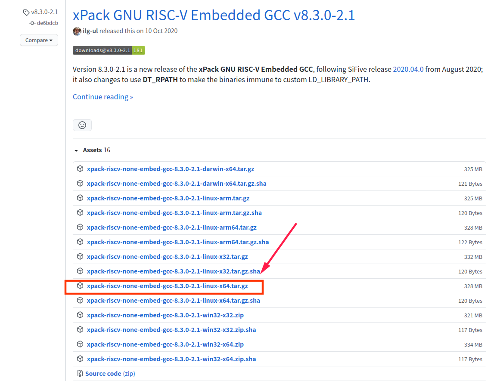
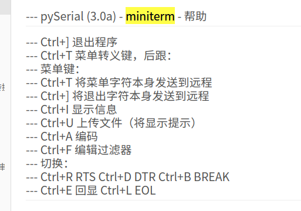

rt-ak plugin k210 ci 所用的测试bsp

仓库地址：https://github.com/RT-Thread/RT-AK-plugin-k210

## RT-AK 使用

> nncase linux 版本下载 https://github.com/kendryte/nncase/releases

RT-AK 运行命令：

```shell
$ python3 aitools.py --project /home/lebhoryi/RT-Thread/Mnist/k210-mnist-project --model_name=mnist  --platform k210 --dataset=/home/lebhoryi/RT-Thread/Mnist/datasets --clear
```

## 编译

k210 linux 编译步骤：

1. 下载 GCC https://github.com/xpack-dev-tools/riscv-none-embed-gcc-xpack/releases/tag/v8.3.0-1.2



2. 安装 scons 

```shell
$ sudo apt install scons
```

3. 设置环境变量

    - 方法一： 在终端输入 `export RTT_EXEC_PATH=/home/lebhoryi/Software/xpack-riscv-none-embed-gcc-8.3.0-1.2/bin`

    - 方法二： 修改 BSP 路径下的 `rtconfig.py` 文件，`if os.getenv('RTT_EXEC_PATH')` 上面一行插入 `os.environ['RTT_EXEC_PATH'] = "/home/lebhoryi/Software/xpack-riscv-none-embed-gcc-8.3.0-1.2/bin"`

    - 方法三： 修改 `~/.bashrc` 文件，末尾插入 `export RTT_EXEC_PATH=/home/lebhoryi/Software/xpack-riscv-none-embed-gcc-8.3.0-1.2/bin`

4. 编译 `scons -j 12`

## 烧录

安装 kflash

```shell
$ pip3 install kflash
```

烧录

```shell
# -t 是烧录完成后打开终端
$ kflash -B kd233 -t rtthread.bin
```

烧录之后退出



------

-t 参数打开终端是通过  `serial.tools.miniterm` 实现的
